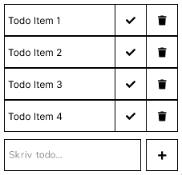

# PDC Frontend Opgave

## Formålet

Denne app er et led i PDC's ansættelsesprocedure. Målet er at teste en ny frontend medarbejder i React og se hvordan nogle af de problemstillinger der fremstilles bliver løst.

## Opgaven

Du skal lave en simpel TODO app, gerne typet med TypeScript.

1. Vis en liste af TODO items fra backenden (se afsnittet [Backend](#backend))
2. Brugeren skal kunne tilføje et nyt item
3. Man skal kunne markere et item som completed, du kan enten strege den ud eller flytte den til en ny sektion.
4. Hvis du trykker på et item skal der vises en dialog modal hvor du kan tilføje/redigere en note.
5. Du skal kunne slette et item

Designet er helt op til dig - Men app'en kunne se sådan ud:



## Værd at bemærke

- Du må gerne style app'en. Men det er ikke et krav at den bliver pæn, det vigtige er at den virker.
- Du skal være mere end velkommen til at skrive tests.
- Husk, det vigtige er ikke hvordan du løser opgaven. Det vigtige er at du kan forklare hvorfor du har valgt at løse opgaven på den måde du har.

## Backend

Det hele skal gemmes i en backend. Her har du en JSON Server tilgængelig.

En JSON Server skal blot startes, og så overvåger den en db.json fil og exposer samtidigt de nødvendige endpoints (POST,GET,PUT).

Du kan starte serveren ved at køre:

```
npm run backend
```

Serveren kører på port http://localhost:5000 (porten kan ændres i package.json)

Endpoints tilgængelig er:

```
GET    /todos
GET    /todos/<id>
POST   /todos
PUT    /todos/<id>
PATCH  /todos/<id>
DELETE /todos/<id>
```

Du kan se flere detaljer om de tilgængelige endpoints her: [https://github.com/typicode/json-server](https://github.com/typicode/json-server#routes)
